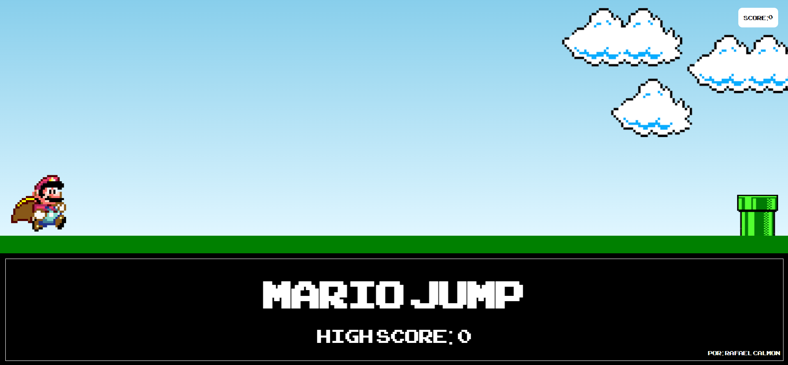

# JOGO MARIO JUMP



## Tecnologias Utilizadas:
- HTML 5
- CSS3
- JavaScript

---

## Como jogar?
O jogo inicia **automaticamente ao abrir o site**, para fazer o Mario pular basta apertar qualquer tecla do teclado. Cada vez que o jogador conseguir pular o cano a pontuação irá aumentar (canto superior direito). Quando ele bater no cano o jogo irá parar e aparecerar *'GAME OVER'* e um botar de reiniciar. Embaixo temos a maior pontuação feita pelo jogador até então (caso recarregue o site esse recorde reseta)

[Acesse o álbum da diva](https://genius.com/albums/Kelsea-ballerini/Subject-to-change)

Para que serve o comando `document.getElementById()` do JavaScript 


Programa em python:
```
idade = 25
if idade >= 18:
  print("Maior de idade")
```

## Tabelas
Num | Nome | Matéria | Nota
---|---|---|---
1 | Rafael | Matemática | 10
2 | Tokatti | História | 9,5

Lista de tarefas:
- [x] Criar tela 2
- [x] Terminar branch
- [ ] Receber endpoints

Lista numerada:

1. Teste
2. Teste2
   1. Teste3

Lista demarcada:
* Teste
* Teste
  * Teste
